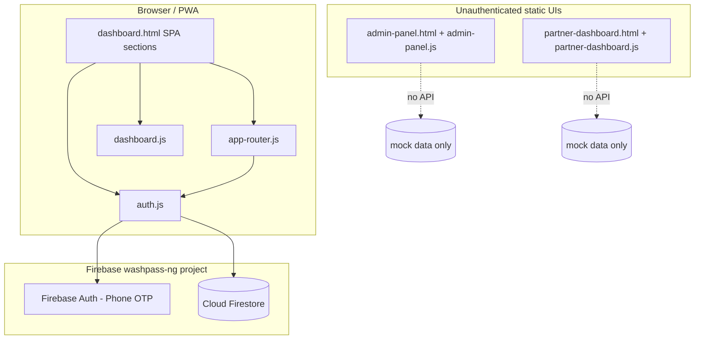
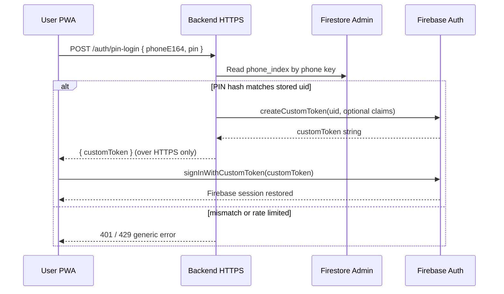

# WashPass — Application Overview

This document reflects the codebase audit (STEP 0) plus **ongoing updates after every meaningful change**. The **changelog** below is the running record of what was decided and implemented.

### Changelog (high level)

| When | Change |
|------|--------|
| STEP 0 | Initial audit; documented stack, gaps, and Firestore shapes. |
| Task 1 (attempt) | Email/password + mandatory email verification + reset flow — **reverted** per product feedback (Nigerian users prefer low-friction phone auth; email verification felt too heavy to manage). |
| **Current** | Customer auth is again **phone SMS (OTP) + optional 6-digit PIN** (`auth.js`, `dashboard.html`). UX errors use **`showNotification`** toasts when available, else `alert`. PIN + expired Firebase session **no longer opens Firestore without auth**: user is sent a **fresh OTP** instead of the old “virtual user” pattern. `phone_index` is **active** for PIN routing. Reference **`firestore.rules`** remains for locking `customers/{uid}` to `request.auth.uid`. |
| **PIN length** | **6 digits** (numeric only). Accounts that previously saved a **4-digit** hash must use **“Forgot PIN? Use SMS code”** once, then set a new **6-digit** PIN (old hash will not match). |
| **Apr 11, 2026** | **Task 2 Complete**: Subscription & Wash Log logic implemented. Dashboard is now synced to live Firestore data (wishes remaining, plan status, points). |
| **Apr 12, 2026** | **Task 3 Complete**: QR Scanner HUD is now integrated with the `redeemWash` API. Multi-vehicle "Scan then Select" flow is active. |
| **Apr 12, 2026** | **Audit & Stabilization**: Resolved critical syntax error in `auth.js`. Hardened `firestore.rules` for `phone_index` protection. Optimized `sw.js` with Network-First strategy and registered SW in all dashboards. Added defensive checks to router and dashboard logic. |

---

## 1. Architecture (tech stack & data flow)

The repository is a **static multi-page PWA** (HTML, CSS, vanilla JavaScript). There is **no server application** in this repo (no Node, Python, PHP, or serverless functions checked in). Real persistence exists only where the **Firebase Web SDK** is wired on the customer dashboard.



| Layer | Technology |
|--------|------------|
| UI | HTML5, CSS (`assets/css/*`), Font Awesome, Google Fonts (Inter) |
| Customer app shell | `dashboard.html` — sections toggled as a pseudo-SPA; hash routing in `app-router.js` |
| Auth & customer data (partial) | Firebase 10.8 compat: `firebase-app`, `firebase-auth`, `firebase-firestore` in `dashboard.html` |
| QR scanning (customer) | `html5-qrcode` (CDN); scan handler is stubbed |
| PWA | `manifest.json`, `sw.js` (Network-First fetch for logic/HTML, stale-while-revalidate for assets) |
| Admin / Partner | Separate HTML pages; **PWA-enabled** (Service Worker registered), simulated metrics and flows |

**Data flow (customer app):** **Phone (+234…)** → Firebase **Phone Auth** (SMS OTP + reCAPTCHA) → Firestore **`customers/{uid}`** and **`customers/{uid}/vehicles`**, plus **`phone_index/{digits}`** for PIN hash / `hasPin` / `uid` linkage — all from the **browser**. Firebase **refreshes ID tokens** in the SDK (no custom JWT server in this repo). Admin and partner dashboards do not read or write Firestore.

---

## 2. Directory / module structure

```
CAR WASH/
├── APP_OVERVIEW.md          # This file
├── README.md                # Describes prototype; partially outdated vs Firebase wiring
├── index.html               # Meta refresh → dashboard.html
├── dashboard.html           # Main PWA: home, cart, profile, garage, locations, auth modal, Firebase scripts
├── admin-panel.html         # Static admin UI
├── partner-dashboard.html   # Static partner UI
├── manifest.json
├── firebase.json            # Firebase CLI: Firestore rules path
├── firestore.rules          # Example rules: per-user `customers` + `vehicles`
├── sw.js                    # Service worker (limited asset list)
├── assets/
│   ├── css/                 # styles, mobile-app, dashboard, admin, partner, auth, car-theme
│   ├── js/
│   │   ├── auth.js          # Firebase phone OTP + PIN, Firestore sync, vehicle listener cleanup
│   │   ├── app-router.js    # Section switching, hash, cart state, auth modal helpers
│   │   ├── dashboard.js     # Garage UI, mock locations, QR scanner stub, notifications
│   │   ├── admin-panel.js   # Charts/animations/export simulation
│   │   ├── partner-dashboard.js  # Queue/QR UI simulation
│   │   └── script.js        # Legacy landing (if used elsewhere)
│   └── images/
```

---

## 3. Auth flow — current state (phone OTP + PIN)

### Product rationale (documented)

- **Email + mandatory verification** was tried and **rolled back**: stakeholders want a **simple** path suited to Nigerian users — **SMS OTP** is familiar; **optional PIN** speeds repeat login **only while a Firebase phone session is still valid**.

### Implemented flow (`auth.js` + `dashboard.html`)

1. **Welcome** until `Auth.getUser()` is non-null (`FirebaseAuth.currentUser` and/or `pinVerified` after a successful PIN+session path — see `getUser()`).
2. **Phone:** user enters 10 digits (after `+234`) → **Continue** → `smartRoute`:
   - Reads **`phone_index/{phoneKey}`** (`phoneKey` = E.164 without `+`).
   - If **`hasPin`**: show **PIN** step (no SMS yet).
   - Else: **`signInWithPhoneNumber`** (invisible reCAPTCHA) → **OTP** step.
3. **PIN:** hash compared to **`phone_index.pinHash`** (SHA-256 of **6-digit** numeric PIN).  
   - If PIN matches **and** `firebase.auth().currentUser.uid` matches stored `uid`: treat as signed in, **`loadProfileAndEnter`**, set **`pinVerified`**, cache hash in `localStorage` (`wp_pin`).  
   - If PIN matches **but** there is **no** valid Firebase session (or UID mismatch): **do not** use a fake “virtual” user for Firestore; **`sendOTP`** is called again and the UI moves to the **OTP** step with a short toast explaining why.
4. **OTP:** user enters SMS code → `confirmationResult.confirm` → Firebase user → `onAuthStateChanged` → **`syncUserData`**: creates **`customers/{uid}`** if missing, then **PIN setup** (optional) → **name** if missing → home.
5. **Forgot PIN:** falls back to **SMS OTP** for that phone.
6. **Logout:** `signOut`, clears `wp_pin`, **`pinVerified` = false**, detaches vehicle listener, welcome.

### UX / errors

- **`notifyAuth`**: prefers **`showNotification`** (`dashboard.js`); falls back to **`alert`** if toast helper is missing.
- **`Auth.smartRoute` / `verifyPIN` / `verifyOTP` / `setupPIN` / `saveProfileName`** take **`event`** where needed so the code does not rely on deprecated global `event`.

### Engineering notes & known limitations

| Topic | Notes |
|-------|--------|
| **PIN vs persisted Firebase session** | If the user had chosen a PIN but the Firebase phone session expired, they receive **one SMS** to re-establish a real credential before Firestore writes (aligns with strict **Security Rules**). |
| **Session still bypasses PIN on cold start** | If Firebase restores a phone session on page load, **`getUser()`** can return logged-in **before** PIN is re-entered (same class of behaviour as the original prototype). Tightening that would require extra client state or a backend-issued step-up token. |
| **No email / password reset in UI** | Intentionally removed from the customer flow after rollback. |

### Remaining gaps vs master prompt (auth slice)

| Gap | Notes |
|-----|--------|
| **Custom JWT backend** | Not in repo; Firebase handles phone tokens client-side. |
| **Admin / partner** | Still unauthenticated static pages. |
| **`Auth.checkAuth()`** | Still a stub; routing is driven by **`onAuthStateChanged`** + **`switchSection`**. |

### Firebase Console checklist (operator)

- Enable **Phone** under Authentication → Sign-in method; configure **reCAPTCHA** / test phone numbers as needed.
- **Authorized domains** for your hosting origin.
- Deploy **`firestore.rules`** (see repo root) so only **`request.auth.uid`** can access that user’s **`customers/{uid}`** and **`vehicles`**.

---

## 4. Database schema — current state (Firestore, inferred from code)

Collections used in `assets/js/auth.js`:

### `customers/{uid}` (document id = Firebase Auth `uid`)

| Field (observed) | Type / usage |
|------------------|--------------|
| `phone` | string (from Firebase Phone Auth) |
| `name` | string (optional until name step) |
| `points` | number |
| `washes` | number (display counter; not tied to subscription logic in code) |
| `joinedAt` | server timestamp |
| `status` | string (e.g. `'active'`) |
| `location` | string (optional; can be hard-coded display string from “GPS”) |

**Subcollection:** `customers/{uid}/vehicles/{vehicleId}`

| Field | Usage |
|--------|--------|
| `make`, `model`, `year`, `plate`, `color` | Set in `handleAddVehicle` |

### `phone_index/{phoneKey}`

`phoneKey` = E.164 without `+` (e.g. `2348012345678`).

| Field | Usage |
|--------|--------|
| `uid` | Firebase Auth UID for that phone |
| `pinHash` | SHA-256 hex of **6-digit** numeric PIN (legacy docs may still hold a 4-digit hash until the user resets via SMS) |
| `hasPin` | If true, **smart route** shows PIN step before SMS |

**Not present in code (required by master spec):** structured `subscription` object, `wash_logs`, `city` enum, plan tier caps, partner documents, partner QR payloads, atomic redemption, admin audit fields.

---

## 5. Known broken or missing features (relative to master prompt)

- **Backend API** for auth, subscriptions, QR redemption, caps, and roles: **missing** (exception: **PIN → custom token** flow is **planned** in **§7**, not built yet).
- **Email/password auth, email verification, password reset** (customer PWA): **not used** (rolled back to phone OTP + PIN for UX). **Custom JWT backend**: still **missing** (Firebase phone ID tokens only).
- **Customer data model** (profile + cars + subscription + wash log as single source of truth): **partial** (profile + vehicles only; no subscription/wash log model in Firestore).
- **Pricing / plans** in UI (`dashboard.html`) **do not match** the spec table (e.g. Single Wash ₦4,500 vs spec ₦5,000; Silver/Gold counts differ; no frequency caps in code).
- **QR partner identification + server validation + atomic deduct + cap enforcement**: **missing** (scanner only toasts and `console.log`).
- **Partner QR generation** (UUID/signed token) and display in admin/partner dashboards: **missing**.
- **Admin dashboard** capabilities (list/filter users, edit washes, onboard partners, QR, revenue): **UI mock only** in `admin-panel.js`.
- **Partner portal** (own QR, redemption log, scoped data): **mock only**; partner “validation” uses fake `WP-####-####-####` pattern with `setTimeout`.
- **Role enforcement at API**: **not applicable** until an API exists; current Firestore access is **direct from browser** (govern with **`firestore.rules`** in repo + deploy).

---

## 6. Environment variables and configuration dependencies

| Config | Where | Notes |
|--------|--------|--------|
| Firebase Web config | Hardcoded in `assets/js/auth.js` | `apiKey`, `authDomain`, `projectId`, `storageBucket`, `messagingSenderId`, `appId`, `measurementId` |
| `.env` | Not used | `.gitignore` includes `.env`; no build step reads env in this static project |
| External CDNs | `dashboard.html` | Firebase compat 10.8.0, Font Awesome, Google Fonts, `html5-qrcode` |
| PWA icons | `manifest.json` | `assets/images/pwa-icon.png` is **referenced but missing** from the repo (`assets/images/` only contains `nigeria-bridge.jpg` at audit time) — install/add icon asset before production. |
| Service worker cache | `sw.js` | Fixed list of assets; **cache-buster query strings** on scripts in HTML are **not** mirrored in `ASSETS_TO_CACHE` (stale-cache risk during dev) |
| Firestore rules (reference) | `firestore.rules` + `firebase.json` | Locks **`customers/{uid}`** + **`vehicles`** to `request.auth.uid`. **`phone_index`**: **world-readable**; **create/update** strictly limited to the matching `uid` to prevent index hijacking. Deploy: `firebase deploy --only firestore:rules`. |

**Operational dependencies:** Firebase project `washpass-ng` with **Phone** authentication enabled, **reCAPTCHA** / authorized domains, and deployed **Firestore rules** matching `firestore.rules` (per-user `customers` + `vehicles`).

---

## 7. Task 1: PIN login without extra SMS (Status: DEPLOYED)

**Goal:** After the Firebase **phone** session expires, a returning user who still knows their **PIN** can sign back in **without** a second SMS OTP, while keeping **Firestore rules** strict (all reads/writes require a real `request.auth.uid`).

**Idea:** Only a **trusted server** holding the **Firebase Admin SDK** service account can mint a **custom token** for a given `uid`. The client proves knowledge of the PIN to that server; the server verifies (hash compare) and returns a short-lived opaque token the client exchanges via `signInWithCustomToken`.

### End-to-end flow



### Backend shape (pick one)

| Option | Pros | Cons |
|--------|------|------|
| **HTTPS Cloud Function** (`onRequest` or Callable) | Same GCP/Firebase bill, minimal ops, easy CORS | Cold start; tune min instances if latency matters |
| **Cloud Run** (tiny Express/Fastify) | Predictable HTTP, good for rate limiting middleware | Slightly more wiring (Docker, IAM) |
| **Existing VPS** (Node + Admin SDK) | Full control | You manage TLS, uptime, secrets rotation |

**Recommendation for “small backend”:** one **regional HTTPS Cloud Function** (2nd gen) `pinLogin`, plus **Secret Manager** (or Firebase Functions config) for the service account JSON — **never** commit the service account to git.

### API contract (draft)

- **`POST /auth/pin-login`** (or Callable `pinLogin`)
  - **Body:** `{ "phone": "+2348012345678", "pin": "123456" }` (PIN sent only over TLS; consider **not** logging bodies).
  - **Server steps:**
    1. Normalize phone to the same **`phoneKey`** format as the client (`234…` without `+`).
    2. **Rate limit** by `phoneKey` + client IP (e.g. Cloud Armor, Redis, or Firestore counter with transaction — start simple: in-memory per instance + strict global cap if single region).
    3. Admin-read **`phone_index/{phoneKey}`**; if missing or `!hasPin`, return **404** (same message as wrong PIN to avoid enumeration).
    4. **SHA-256** the submitted PIN the same way as the client (`auth.js`); constant-time compare to `pinHash`.
    5. On success: **`admin.auth().createCustomToken(uid, { authBy: 'pin' })`** (optional claims for analytics only; do not trust claims for authorization in Firestore — use `uid` only).
  - **Response:** `{ "customToken": "<jwt>" }` or error `{ "error": "invalid_credentials" }`.
  - **Client:** `firebase.auth().signInWithCustomToken(customToken)` then existing **`syncUserData`** runs as today.

**Callable vs raw HTTP:** Callable gives you built-in **App Check** hook later; raw HTTP is easier to test with `curl`. Either is fine for v1.

### Security (non-negotiable)

- **6-digit numeric PIN** (~1M combinations) is still guessable at scale if the endpoint is public. Mitigations:
  - **Hard rate limits** (per phone + per IP): e.g. 5 attempts / 15 min, then exponential backoff or temporary lock flag in `phone_index` or separate `pin_attempts/{phoneKey}` doc written only by backend.
  - Optional **longer PIN or alphanumeric** later without changing the custom-token flow.
  - **Generic errors** (“Could not sign in”) for wrong PIN vs missing user vs locked.
- **CORS:** allow only your **production** and **staging** origins; block `*` in production.
- **App Check** (recommended phase 2): require valid App Check token on the function to reduce scripted guessing.
- **Audit:** structured log `phoneKey` prefix (e.g. last 2 digits only) + `uid` + outcome; never log full PIN or full token.

### Firestore rules impact (improvement path)

Today the client may **read** `phone_index` for `hasPin` routing. Once the backend owns PIN verification:

- **Option A (minimal change):** keep client read for `hasPin` only; **writes** still server-assisted or client after OTP (current).
- **Option B (tighter):** remove **public** `phone_index` reads from clients; **`smartRoute`** calls a tiny **`GET /auth/lookup-phone?phone=…`** that returns only `{ hasPin: boolean }` (no uid). Slightly more latency, better privacy.

### Client changes (`auth.js`) when implemented

1. In **`verifyPIN`**, when Firebase session is missing but PIN matches: **`fetch(CLOUD_FUNCTION_URL, { method: 'POST', body: JSON.stringify({ phone, pin }) })`**, then **`signInWithCustomToken`** on success; on failure show same toast as wrong PIN.
2. **`CLOUD_FUNCTION_URL`** from a **single config** (e.g. `window.__WASHPASS_CONFIG__` injected at deploy, or env at build time if you add a bundler later) — not scattered literals.
3. Remove the **“sending fresh OTP”** branch for this case (keep OTP for forgot PIN / first-time onboarding unchanged).

### Implementation checklist (for when you build it)

- [x] Create Firebase **service account** / enable **Admin SDK** in Functions. [x]
- [x] Implement **`pinLogin`** with rate limiting + hash verify + `createCustomToken`. [x]
- [x] Lock down **IAM** (Service Account Token Creator role granted). [x]
- [ ] Add **integration test** (emulator or staging): valid PIN → custom token → client sign-in.
- [x] Update **`auth.js`** branch in `verifyPIN` and deploy PWA. [x]
- [x] **Changelog** row in this file when shipped. [x]

### New configuration (when built)

| Variable | Where | Purpose |
|----------|--------|---------|
| `PIN_LOGIN_URL` | Hosting inject / build env | HTTPS endpoint for PIN exchange |
| Service account JSON | Secret Manager / Functions secrets | `createCustomToken` only on server |

---

## 9. Task 3: QR Scanner redemption (Status: COMPLETE)

The HUD scanner now functions as a live redemption tool:
- **Zero-Friction Scan**: Scans Hub QR and identifies the location instantly.
- **Multi-Vehicle Support**: If the user has multiple cars, a haptic-enabled picker appears within the scanner view.
- **Authorized Logs**: Successful redemptions trigger a Firestore Transaction that decrements the wash count and creates a permanent record in `wash_logs`.
- **Haptic Feedback**: High-quality vibration patterns denote success vs. processing vs. failure.
