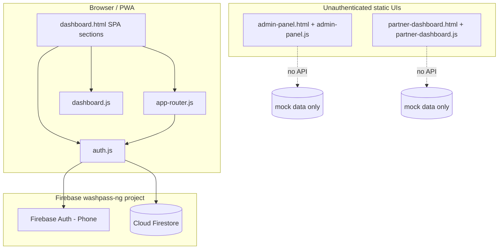

# WashPass — Application Overview

This document reflects a **full codebase audit** as of the initial agent pass (STEP 0). It should be updated after every major change.

---

## 1. Architecture (tech stack & data flow)

The repository is a **static multi-page PWA** (HTML, CSS, vanilla JavaScript). There is **no server application** in this repo (no Node, Python, PHP, or serverless functions checked in). Real persistence exists only where the **Firebase Web SDK** is wired on the customer dashboard.



| Layer | Technology |
|--------|------------|
| UI | HTML5, CSS (`assets/css/*`), Font Awesome, Google Fonts (Inter) |
| Customer app shell | `dashboard.html` — sections toggled as a pseudo-SPA; hash routing in `app-router.js` |
| Auth & customer data (partial) | Firebase 10.8 compat: `firebase-app`, `firebase-auth`, `firebase-firestore` in `dashboard.html` |
| QR scanning (customer) | `html5-qrcode` (CDN); scan handler is stubbed |
| PWA | `manifest.json`, `sw.js` (network-first fetch, asset cache) |
| Admin / Partner | Separate HTML pages; **no Firebase, no auth, no backend** — simulated metrics and flows |

**Data flow (today):** Phone OTP → Firebase Auth session → Firestore `customers` + `phone_index` + `vehicles` subcollection, all from the **browser**. Admin and partner dashboards do not read or write Firestore.

---

## 2. Directory / module structure

```
CAR WASH/
├── APP_OVERVIEW.md          # This file
├── README.md                # Describes prototype; partially outdated vs Firebase wiring
├── index.html               # Meta refresh → dashboard.html
├── dashboard.html           # Main PWA: home, cart, profile, garage, locations, auth modal, Firebase scripts
├── admin-panel.html         # Static admin UI
├── partner-dashboard.html   # Static partner UI
├── manifest.json
├── sw.js                    # Service worker (limited asset list)
├── assets/
│   ├── css/                 # styles, mobile-app, dashboard, admin, partner, auth, car-theme
│   ├── js/
│   │   ├── auth.js          # Firebase phone auth, PIN helpers, Firestore sync
│   │   ├── app-router.js    # Section switching, hash, cart state, auth modal helpers
│   │   ├── dashboard.js     # Garage UI, mock locations, QR scanner stub, notifications
│   │   ├── admin-panel.js   # Charts/animations/export simulation
│   │   ├── partner-dashboard.js  # Queue/QR UI simulation
│   │   └── script.js        # Legacy landing (if used elsewhere)
│   └── images/
```

---

## 3. Auth flow — current state and identified issues

### Implemented flow (customer / `auth.js`)

1. User opens `dashboard.html`, sees **welcome** until `Auth.getUser()` reports logged in.
2. **Phone entry** → `Auth.smartRoute()` reads Firestore `phone_index/{phoneDigits}`.
   - If `hasPin`: show **PIN step** (no SMS).
   - Else: `signInWithPhoneNumber` + invisible reCAPTCHA → **OTP step**.
3. **OTP** → `confirmationResult.confirm(code)` → Firebase user → `onAuthStateChanged` → `syncUserData`.
4. **New Firestore profile**: `customers/{uid}` created with `phone`, `points`, `washes`, `joinedAt`, `status`; UI moves to **PIN setup** (or name if skipped path).
5. **PIN setup**: SHA-256 hash stored in `phone_index` and `localStorage` (`wp_pin`).
6. **Name**: `saveProfileName()` updates `customers/{uid}` with `name`.
7. **Logout**: `signOut`, clears `wp_pin`, welcome section.

### Mismatch vs product spec (master prompt)

- Spec asks for **email/password signup**, **email verification**, **JWT (or equivalent)**, **password reset**, and **API-level route protection**.
- Current implementation is **phone + SMS OTP + optional 4-digit PIN** only. No email auth, no password reset, no custom JWT backend.

### Root causes / failure points (bugs & risks)

| Issue | Severity | Notes |
|--------|-----------|--------|
| **PIN not required when Firebase session exists** | High | `getUser()` returns logged in if `currentUser` is set, even when `pinVerified` is false. After OTP, a persisted Firebase session can reopen the app **without re-entering PIN**, defeating the “returning user: phone → PIN” intent. |
| **“Virtual” session after PIN without Firebase** | High | `loadProfileAndEnter` sets `currentUser` with `isVirtual: true` when Firebase session is missing. Any Firestore write (`addVehicle`, `update` location) uses `uid` **without** a Firebase ID token unless rules allow unauthenticated access — **likely broken or insecure** under default Firestore rules. |
| **`smartRoute` / `verifyOTP` / `saveProfileName` use global `event`** | Medium | Handlers use `event.target` without receiving `event` as a parameter; behaviour depends on browser `window.event` (unreliable in strict mode / some environments). |
| **Errors mostly `alert()`** | Medium | Not aligned with “graceful error messaging”; poor mobile UX. |
| **Recaptcha init on `window.load`** | Low | Race: user may tap Continue before verifier is ready. |
| **Firebase config in source** | Operational | `apiKey` and project IDs are public by design for Firebase client apps, but **must** be paired with correct **Auth providers + Firestore rules**; secrets must never be added to client. |
| **Admin / partner pages: no auth** | Critical (for prod) | Anyone with URLs can open mock admin/partner UIs; **no roles, no API enforcement**. |
| **`Auth.checkAuth()` is empty** | Low | `dashboard.js` calls it; no-op. |
| **Router vs `getUser()`** | Low | `app-router.js` `state.user` falls back to placeholder “Ade” when `getUser()` is null; routing uses `Auth.getUser()` for guards — mostly OK, but state object is misleading. |

---

## 4. Database schema — current state (Firestore, inferred from code)

Collections used in `assets/js/auth.js`:

### `customers/{uid}` (document id = Firebase Auth `uid`)

| Field (observed) | Type / usage |
|------------------|--------------|
| `phone` | string |
| `name` | string (optional until profile step) |
| `points` | number |
| `washes` | number (display counter; not tied to subscription logic in code) |
| `joinedAt` | server timestamp |
| `status` | string (e.g. `'active'`) |
| `location` | string (optional; can be hard-coded display string from “GPS”) |

**Subcollection:** `customers/{uid}/vehicles/{vehicleId}`

| Field | Usage |
|--------|--------|
| `make`, `model`, `year`, `plate`, `color` | Set in `handleAddVehicle` |

### `phone_index/{phoneKey}`

`phoneKey` = E.164 phone without `+` (e.g. `2348012345678`).

| Field | Usage |
|--------|--------|
| `uid` | Links phone to Firebase user |
| `pinHash` | SHA-256 hex of 4-digit PIN |
| `hasPin` | boolean for smart routing |

**Not present in code (required by master spec):** structured `subscription` object, `wash_logs`, `city` enum, plan tier caps, partner documents, partner QR payloads, atomic redemption, admin audit fields.

---

## 5. Known broken or missing features (relative to master prompt)

- **Backend API** for auth, subscriptions, QR redemption, caps, and roles: **missing**.
- **Email/password auth, verification, password reset, JWT session model**: **missing**.
- **Customer data model** (profile + cars + subscription + wash log as single source of truth): **partial** (profile + vehicles only; no subscription/wash log model in Firestore).
- **Pricing / plans** in UI (`dashboard.html`) **do not match** the spec table (e.g. Single Wash ₦4,500 vs spec ₦5,000; Silver/Gold counts differ; no frequency caps in code).
- **QR partner identification + server validation + atomic deduct + cap enforcement**: **missing** (scanner only toasts and `console.log`).
- **Partner QR generation** (UUID/signed token) and display in admin/partner dashboards: **missing**.
- **Admin dashboard** capabilities (list/filter users, edit washes, onboard partners, QR, revenue): **UI mock only** in `admin-panel.js`.
- **Partner portal** (own QR, redemption log, scoped data): **mock only**; partner “validation” uses fake `WP-####-####-####` pattern with `setTimeout`.
- **Role enforcement at API**: **not applicable** until an API exists; current Firestore access is **direct from browser** (must be governed solely by Security Rules — not present in repo).

---

## 6. Environment variables and configuration dependencies

| Config | Where | Notes |
|--------|--------|--------|
| Firebase Web config | Hardcoded in `assets/js/auth.js` | `apiKey`, `authDomain`, `projectId`, `storageBucket`, `messagingSenderId`, `appId`, `measurementId` |
| `.env` | Not used | `.gitignore` includes `.env`; no build step reads env in this static project |
| External CDNs | `dashboard.html` | Firebase compat 10.8.0, Font Awesome, Google Fonts, `html5-qrcode` |
| PWA icons | `manifest.json` | `assets/images/pwa-icon.png` (referenced; verify file exists in deployment) |
| Service worker cache | `sw.js` | Fixed list of assets; **cache-buster query strings** on scripts in HTML are **not** mirrored in `ASSETS_TO_CACHE` (stale-cache risk during dev) |

**Operational dependencies:** Firebase project `washpass-ng` with **Phone** auth enabled, **reCAPTCHA** / authorized domains for hosting URL, and **Firestore** with rules consistent with client usage (today: broad client writes would be required for current code paths, which is risky).

---

## 7. Maintenance note

After each major change, update: architecture diagram (if stack changes), schema section, auth section (bugs fixed / new ones), and the broken/missing checklist.
